# BiliVideoPlayerSystem（仿哔哩哔哩桌面端视频客户端）

## 项目简介

本项目基于 Qt6/C++17 开发的仿哔哩哔哩桌面端视频客户端，采用**单例模式 + 集中式数据中心（DataCenter）**实现 MVC 分层架构，将 UI 展示、业务逻辑与网络通信解耦。整合 mpv 播放内核与 FFmpeg 工具链，实现 HLS 流媒体播放、实时弹幕系统、多角色权限管理等核心功能。通过 Qt 信号槽机制驱动全异步事件流，结合 QNetworkAccessManager 封装 HTTP 通信层，搭建 MockServer 辅助全链路功能验证。

**开发环境与技术栈**：C++17、Qt6（Widgets / Network）、mpv C API、FFmpeg、CMake、QSS、JSON 序列化

---

## 项目模块与技术亮点

### 1. mpv 播放器封装与视频控制

-   封装 mpv C API，通过 `mpv_create` / `mpv_initialize` 管理播放器生命周期，利用 `mpv_set_wakeup_callback` 注册回调并通过信号槽桥接到 Qt 事件循环，实现线程安全的异步事件处理。
-   支持 HLS/TS 分片流媒体播放，通过 `demuxer-start-time` + `time-pos` 双属性计算分片累计播放时间，解决多分片进度不连续问题；监听 `MPV_EVENT_END_FILE` 检测 `playlist-pos` 与 `playlist-count` 判定整体播放结束。
-   播放控制：使用 `mpv_set_property_async` 异步设置 `pause/speed/volume/mute/time-pos` 属性，支持 0.5x/1.0x/1.5x/2.0x 四档倍速、音量滑块调节与静音切换；自定义 `PlaySlider` 控件通过鼠标事件重写（press/move/release）实现拖拽与点击精准跳转。

### 2. 实时弹幕系统

-   弹幕数据按播放时间戳（`playTime`）组织为 `QHash<quint64, QVector<BarrageData>>` 结构，实现与视频播放位置的精准同步。
-   弹幕渲染采用三轨道布局（top/middle/bottom 三个 `QFrame`），通过 `QPropertyAnimation` 控制水平滚动动画，动画结束自动销毁（`delete this`）释放内存。
-   当前登录用户发送的弹幕附带圆形头像标识，使用 `QPainterPath` + `setClipPath` 实现圆形裁剪，配合 `SmoothTransformation` 抗锯齿。
-   弹幕发送前进行登录态校验、视频审核状态校验、空内容校验，发送后同步更新本地 `barrages` 缓存并异步推送到服务器。
-   支持弹幕开关实时切换。

### 3. 视频上传与处理流水线

-   三阶段异步上传流水线：视频文件上传（multipart/form-data POST） → 封面图上传 → 视频元信息提交，通过三个 bool 标志位（`isUploadVideoOk`/`isUploadPhotoOk`/`isDurationOk`）协调异步完成状态。
-   利用 FFmpeg 子进程（`QProcess`）执行 `-vframes 1` 参数截取视频首帧作为默认封面，支持手动更换封面。
-   创建无视频/音频输出的 mpv 后台实例（`vo=null, ao=null`）异步获取视频总时长，通过 `durationChanged` 信号回调，获取后立即断开信号槽并销毁实例防止悬空回调。
-   视频描述支持标题（80字限制）、简介（字数限制）、分类选择（`QComboBox`）、标签多选（最多5个，`QPushButton` + `setCheckable`），文件格式过滤（mp4/rmvb/avi/mov）与 4GB 大小限制。

### 4. 多模式登录与会话管理

-   实现三种登录模式：临时用户匿名登录、邮箱验证码注册/登录、账号密码登录，通过 `sessionId` 统一会话标识。
-   会话持久化：退出时将 `sessionId` 与角色信息序列化为 JSON 存储到 `QStandardPaths::AppDataLocation`，启动时读取并尝试会话恢复登录，失败则降级为临时用户。
-   启动页（`StartupPage`）使用 `QTimer` 轮询登录与信息获取的双完成标志，确保数据就绪后才进入主界面。
-   输入校验：邮箱格式 `QRegularExpressionValidator`、验证码 `QIntValidator(0, 999999)`、密码强度校验（8-16位，需包含大写、小写、数字、符号中至少两类）。

### 5. 个人中心与社交功能

-   个人主页展示关注数、粉丝数、总点赞量、总播放量；支持修改昵称、修改密码（`NewPasswordDialog` 密码强度实时验证）、上传头像（上传图片到服务器获取 fileId → 更新用户头像 ID → 重新下载显示）。
-   头像圆形裁剪：`QPainterPath::addEllipse` + `QPainter::setClipPath` + 抗锯齿渲染。
-   其他用户主页：点击视频发布者头像跳转至 TA 的主页，展示 TA 的视频列表，支持关注/取消关注，关注按钮状态动态切换。
-   我的视频列表支持右键删除（自定义 `QMenu` 气泡菜单），删除后刷新本地列表。
-   退出登录通过模态确认弹窗（`ConfirmDialog`，半透明遮罩层 + 居中白色面板）。

### 6. 后台管理系统（B端）

-   视频审核管理：支持待审核/通过/驳回/上架/下架全生命周期状态流转，每次操作通过 `ConfirmDialog` 确认，操作后同步更新本地数据与按钮样式，异步通知服务器。
-   管理员角色管理：新增/编辑/删除管理员，支持按邮箱精确查询和按状态（启用/禁用）筛选，邮箱输入正则校验。
-   自定义分页器组件（`Paginator`）：支持超过 7 页时自动折叠省略号按钮，处理前5页/后5页/中间页三种跳转场景，支持输入页码跳转。
-   权限保护：超级管理员不可编辑/删除/禁用，管理员不可操作自身账户，被禁用的管理员无法执行审核操作。

### 7. 网络通信层

-   基于 `QNetworkAccessManager` 封装 `NetClient`，统一 POST/GET 请求构造，每次请求自动生成 UUID `requestId`（`QUuid::createUuid`）便于链路追踪。
-   集中式响应处理：统一解析 HTTP 状态与业务 errorCode，通过 DataCenter 信号分发结果到各 UI 组件。
-   所有网络操作全异步（`QNetworkReply::finished` → lambda），通过信号链 `NetClient → DataCenter → UI` 实现数据流向解耦。
-   图片/视频二进制流上传下载（`application/octet-stream`），JSON 格式业务数据交互。

### 8. UI 框架与自定义控件

-   无边框窗口（`Qt::FramelessWindowHint`）+ 自定义标题栏拖拽（`mousePressEvent`/`mouseMoveEvent` 计算相对位移）。
-   `QGraphicsDropShadowEffect` 窗口阴影、`WA_TranslucentBackground` 透明背景。
-   自定义控件体系：`PageSwitchButton`（带图标的侧栏切换按钮）、`SearchLineEdit`（内嵌搜索图标和按钮）、`AvatarButton`（hover 遮罩层效果）、`VideoBox`（封面+信息卡片，`eventFilter` 点击播放）。
-   首页 `QGridLayout` + `QScrollArea` 无限滚动加载（监听滚动条到底触发下一页请求），视频分类/标签动态按钮切换与联动刷新。
-   Toast 消息提示支持队列管理（`activeToast` 单例 + `pendingText` 排队），2秒自动消失，可携带后续窗口弹出逻辑。
-   QSS 样式表实现全局主题统一，多状态按钮动态切换样式。

## 界面展示

### 首页

点击标签分类后界面

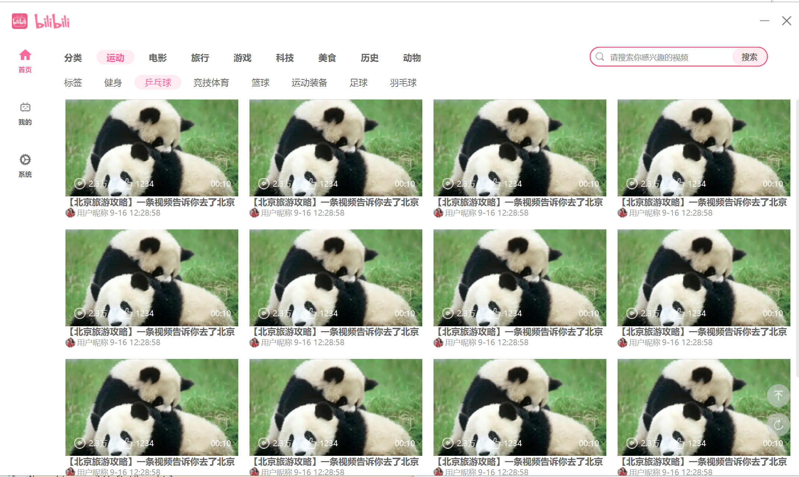

搜索视频

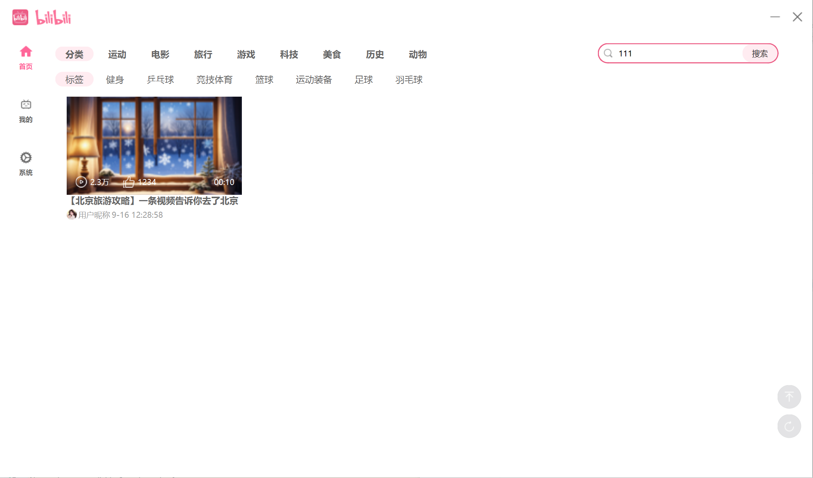

### 我的

上传视频

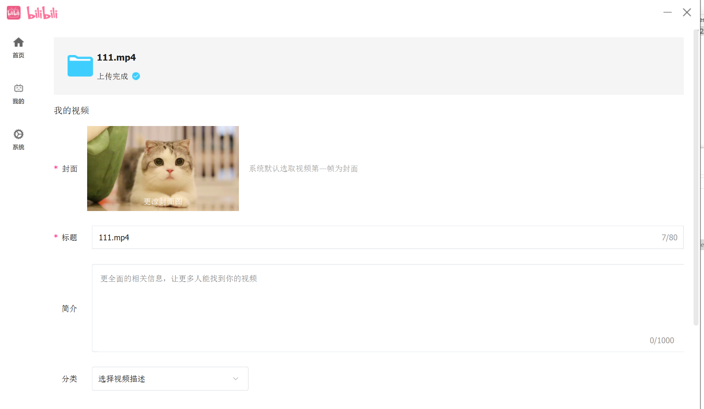

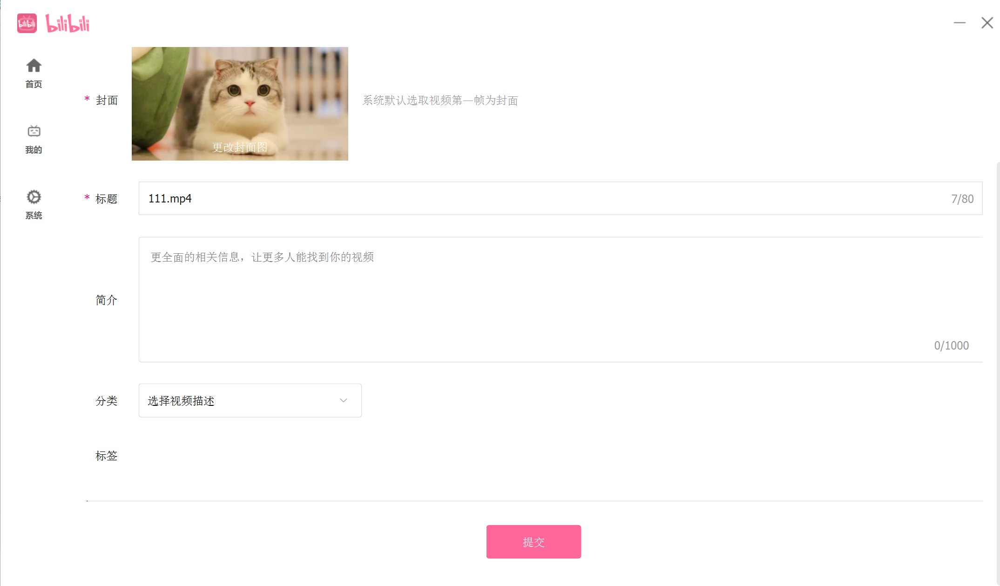

修改个人信息

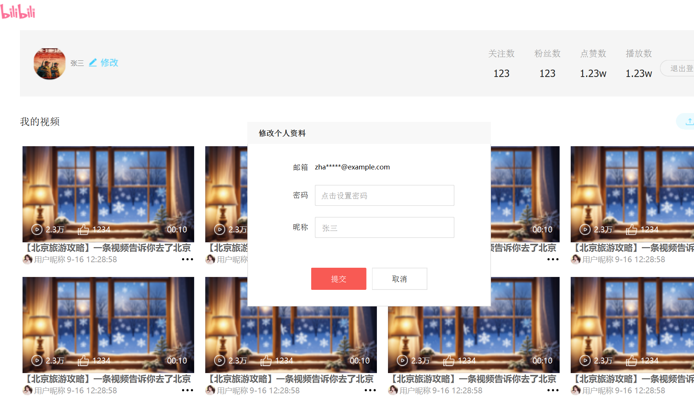

### 系统

审核管理

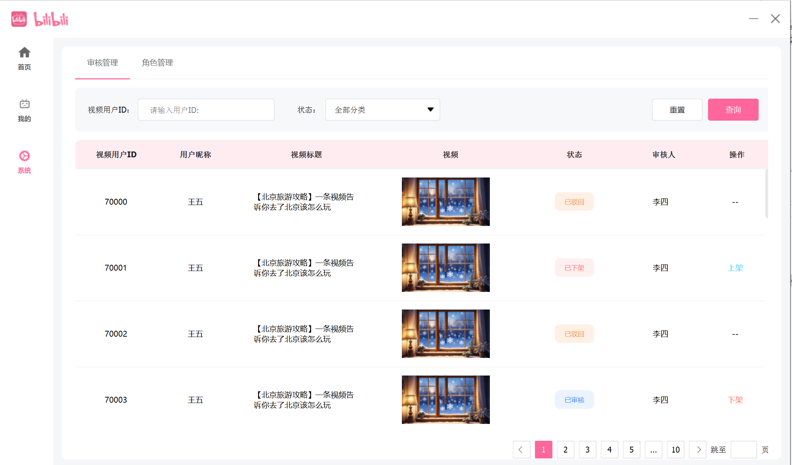

角色管理

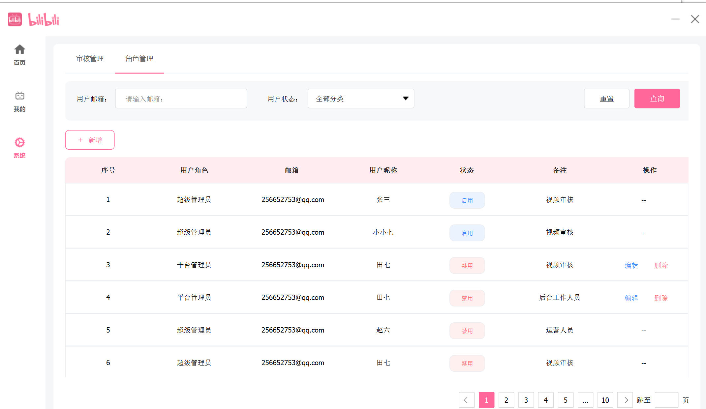

新增后台用户

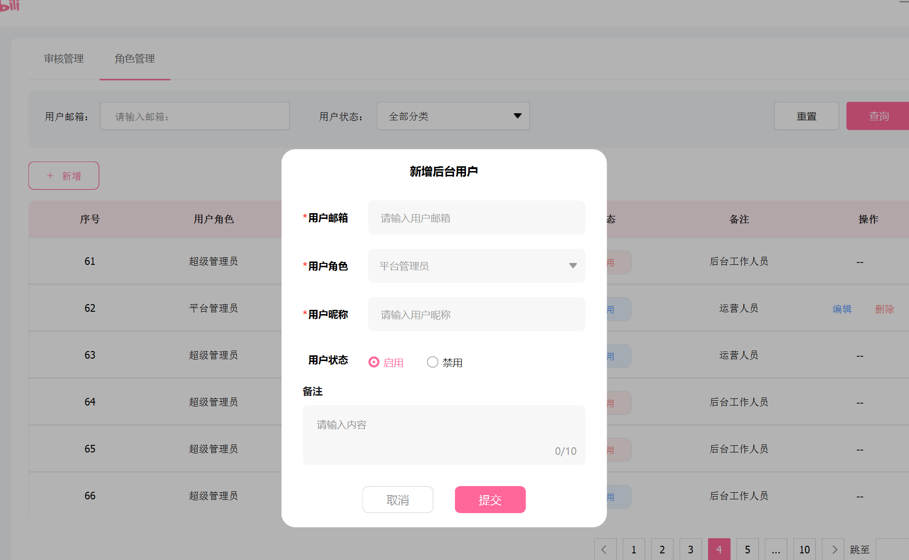

退出登录

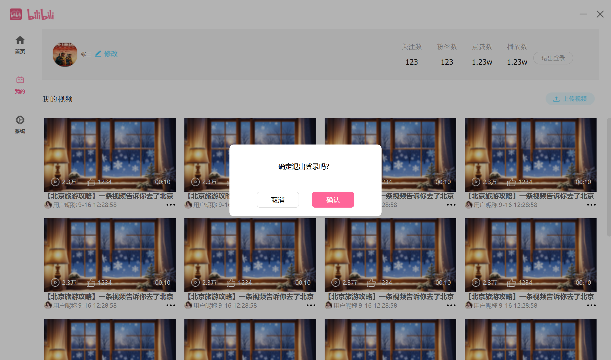

### 播放页面

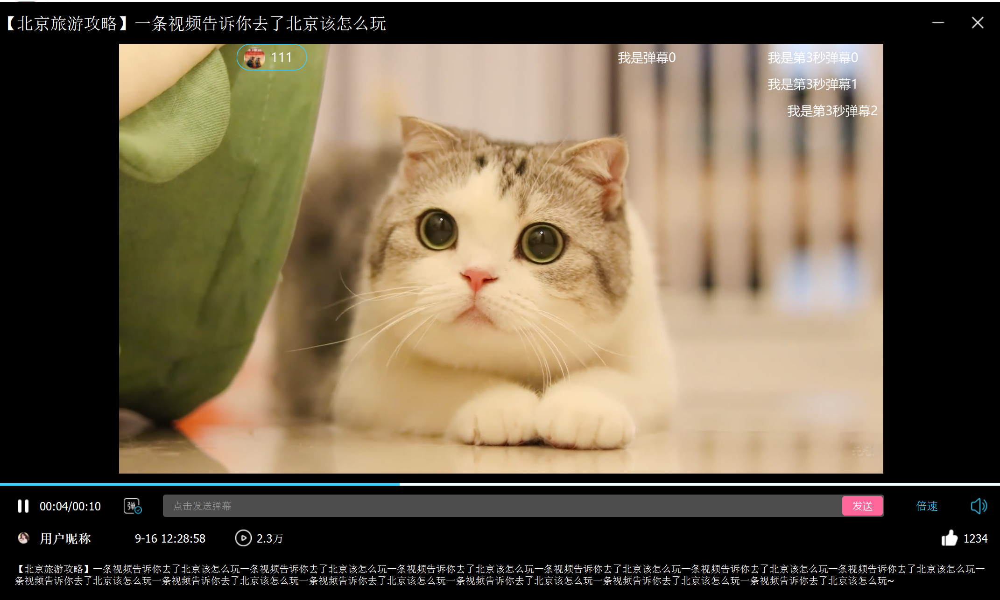

###  登录/注册

邮箱登录

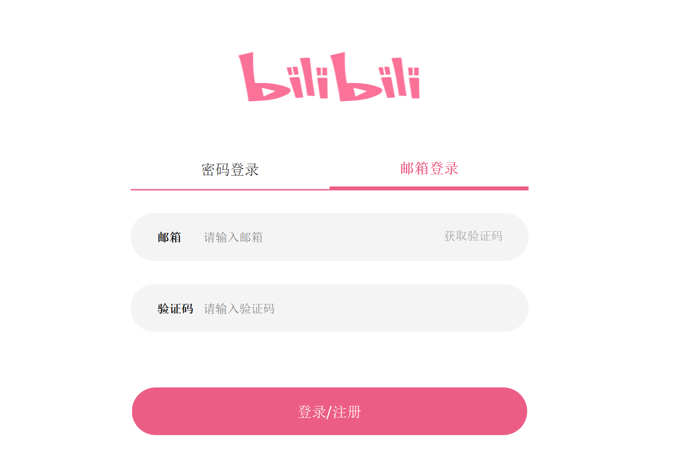

密码登录

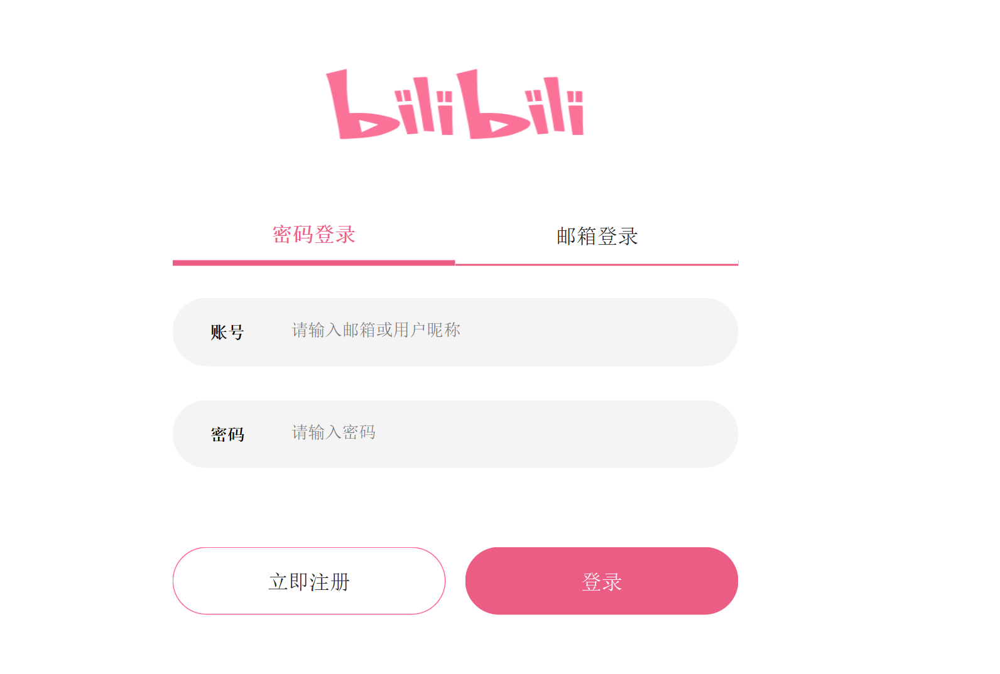

无登录状态

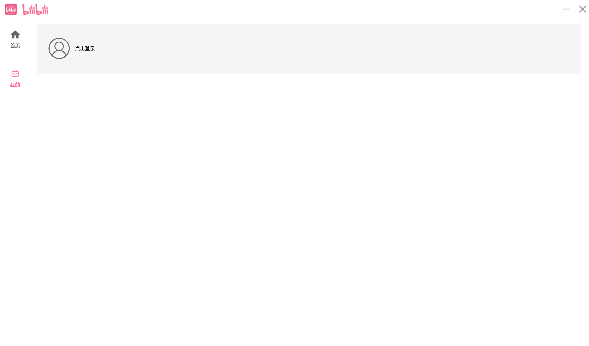